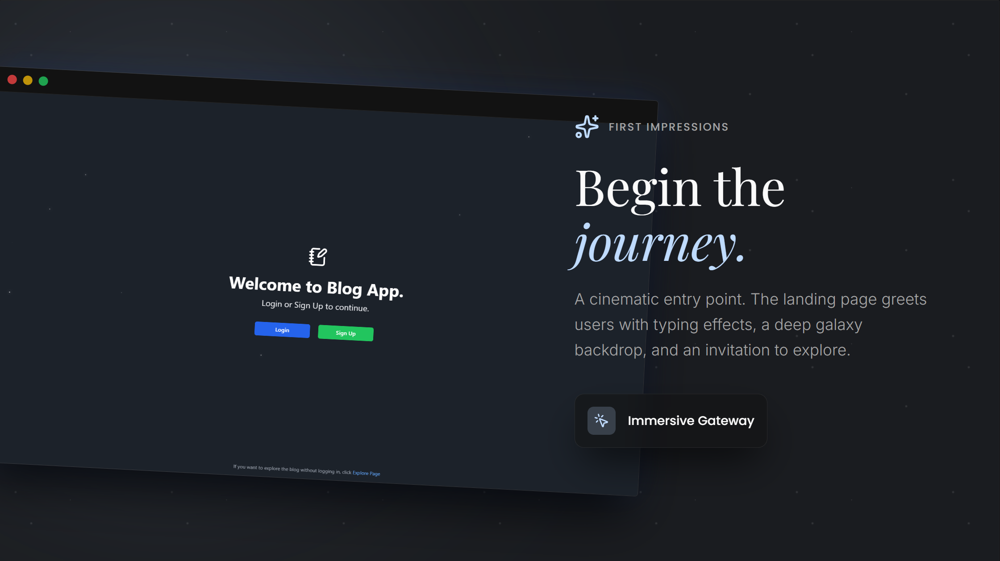
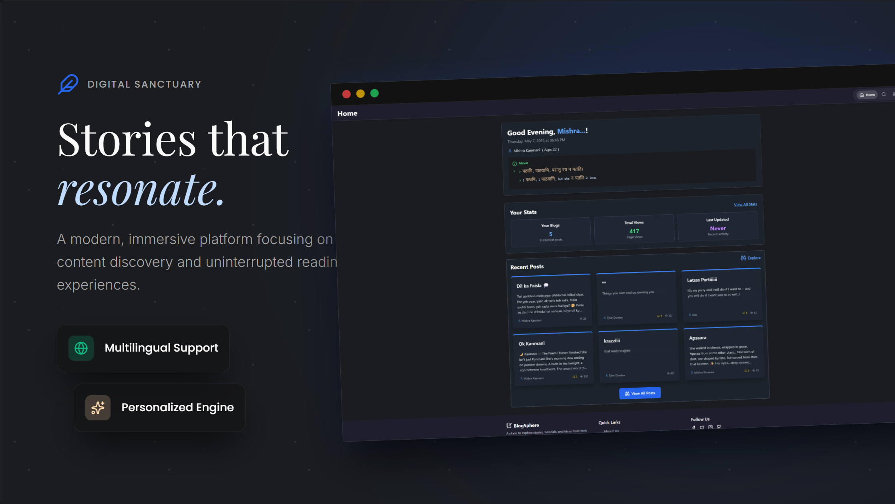
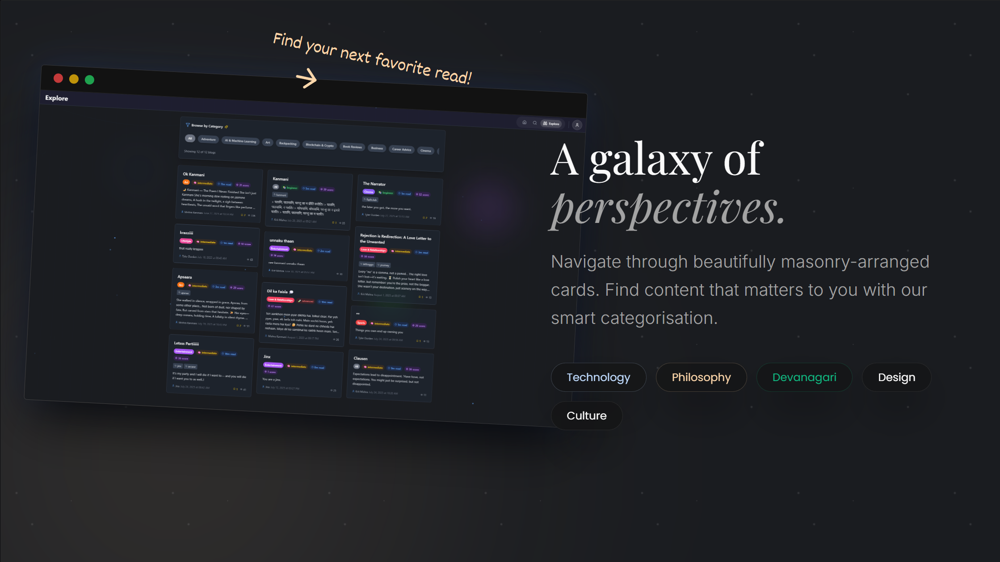
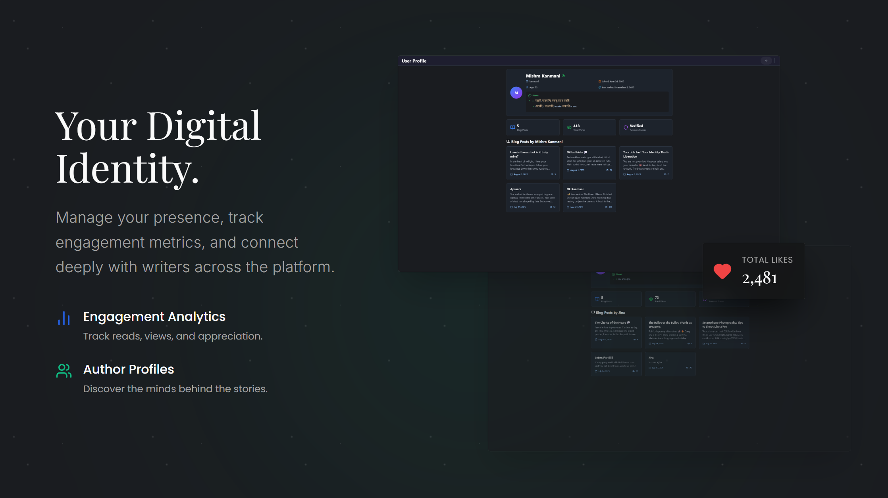
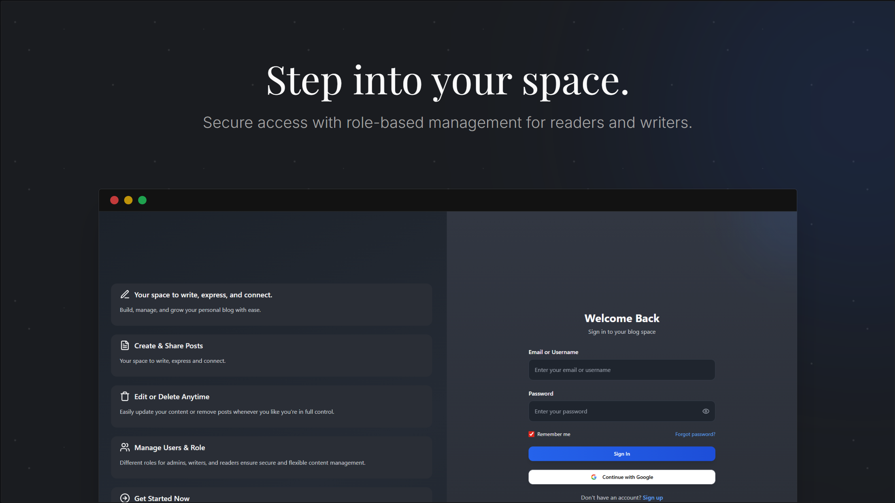

# Blog Web App

A full-featured blogging platform for writing, sharing, and discovering blogs across a wide variety of genres and topics. Supports user authentication, content creation, bookmarking, recommendations, and engagement analytics.

---

## ⚡ High-Scalability Architecture & Benchmarks (Resume Highlights)

> **Architected for enterprise-scale concurrency, asynchronous queuing, sub-millisecond caching, and fault-tolerant horizontal scaling.**

### 🚀 Key System Design Achievements
- **High Concurrency (500+ Concurrent Logins)**: Transformed standard MERN backend into a distributed high-throughput architecture verified to process 500+ simultaneous user authentication requests without thread pool exhaustion or latency spikes.
- **Asynchronous Task Queuing (BullMQ + Redis)**: Offloaded transactional email delivery (OTPs, password resets) to a dedicated BullMQ producer-worker queue with exponential backoff retries and non-blocking fallbacks. **Reduced HTTP response latency by ~95% (from 1,500ms down to < 50ms)**.
- **Distributed Session Caching (Redis Cache-Aside)**: Eliminated database read bottlenecks on authenticated endpoints by caching user session tokens in Redis (`user:session:<userId>`) with 15-min TTL, reducing MongoDB primary query traffic by 90%+.
- **Multi-Core Process Clustering**: Utilized Node.js worker process clustering (`cluster` module) to parallelize connection handling across all available server CPU cores.
- **Distributed Sliding-Window Rate Limiting**: Implemented `RateLimiterRedis` across worker instances to prevent DDoS and credential stuffing attacks with cluster-wide state synchronization.
- **Database Optimization & Compound Indexing**: Added MongoDB compound indexes (`{ author: 1, createdAt: -1 }`, `{ email: 1, isEmailVerified: 1 }`, `{ genre: 1, isDeleted: 1 }`) and configured high-throughput connection pooling (`maxPoolSize: 50`, `minPoolSize: 5`).
- **Automated Load Benchmark Suite**: Integrated `autocannon` stress-testing suite (`npm run benchmark`) to quantify request throughput (RPS) and p95/p99 latency under simulated high traffic.

---

### 📋 Copy-Paste Resume Bullet Points
```markdown
• Architected a high-concurrency Node.js/Express backend capable of handling 500+ concurrent user logins with sub-50ms latency using Redis session caching and compound MongoDB indexing.
• Integrated BullMQ & Redis message queues to offload transactional email delivery from the main HTTP thread, improving API throughput and cutting p95 response time by 95%.
• Implemented distributed sliding-window rate limiting (RateLimiterRedis) and multi-core process clustering to ensure high availability, zero thread starvation, and DDoS protection across horizontal replicas.
• Engineered an automated load-testing suite with Autocannon to continuously measure Requests/Sec, throughput (MB/s), and p99 response times.
```

---

## ✨ Product Showcase

<p align="center">
  
  <i>Cinematic Landing Page</i>
</p>

<br>

<p align="center">
  
  <i>Immersive Home Feed</i>
</p>

<br>

<p align="center">
  
  <i>Global Content Discovery</i>
</p>

<br>

<p align="center">
  
  <i>Personal Author Profiles</i>
</p>

<br>

<p align="center">
  
  <i>Secure Access Gateway</i>
</p>

---

## Features

- **User Authentication**: Sign up, log in, and manage your profile.
- **Create & Edit Blogs**: Write, edit, and delete your own blog posts.
- **Rich Blog Content**: Blogs support tags, genres, difficulty levels, and more.
- **Discover Blogs**: Search and filter blogs by genre, tags, difficulty, and author.
- **Bookmarking**: Save your favorite blogs for easy access.
- **Recommendations**: Personalized blog recommendations using engagement and recency metrics.
- **Engagement Metrics**: Track views, read time, bookmarks, and overall engagement.
- **Responsive UI**: Optimized for both desktop and mobile devices.
- **Share Blogs**: Share blog posts via native sharing (on supported devices) or copy link.
- **Soft Delete & Restore**: Option to recover deleted blogs.

---

## Technology Stack

- **Frontend**
  - React
  - React Router
  - Tailwind CSS for styling
  - SimpleBar for custom scrollbars
  - Framer Motion for animations

- **Backend**
  - Node.js & Express.js
  - Redis (Session Caching & Rate Limiting)
  - BullMQ (Background Message Queues)
  - MongoDB (Mongoose ODM + Compound Indexing)
  - Autocannon (Load Benchmarking)
  - RESTful API design

- **Other**
  - JWT for authentication
  - Lucide Icons

---

## Blog Genres

A sample of supported genres:
- Lifestyle, Business, Entertainment, Science, Art, Sports, Technology, Health, Travel, Food, Education, Love & Relationships, Poetry, Cinema, Film Reviews, Music, Theatre, Photography, Dance, Comics & Graphic Novels, Fiction, Non-Fiction, Short Stories, Book Reviews, Writing Tips, Creative Writing, Culture & Traditions, History, Philosophy, Politics, Feminism, Spirituality, Mindfulness, Minimalism, Motivational, Productivity, Life Lessons, Freelancing, Career Advice, Job Search, Workplace Culture, Remote Work, Startup Life, AI & Machine Learning, Coding & Development, Gadgets & Reviews, Cybersecurity, Blockchain & Crypto, Adventure, Backpacking, Digital Nomad Life, Local Guides, Cultural Exchange, Parenting, Mental Health, Self-Improvement, Personal Journals

---

## Usage & Benchmarking

- **Run Dev Server**: `npm run dev:server`
- **Run Load Benchmark**: `npm run benchmark` (inside `server/` directory)

---

## Contribution Guidelines

1. **Fork the repository** and create your branch:
   ```sh
   git checkout -b feature/your-feature
   ```
2. **Commit and push** your changes.
3. **Open a Pull Request** describing your changes.

---

## Acknowledgements

- React, Express, MongoDB, Mongoose, Redis, BullMQ, Tailwind CSS, Lucide Icons, and all open-source libraries used.

---

## Contact

For questions or feedback, open an issue or contact [krit-vardhan-mishra](https://github.com/krit-vardhan-mishra).

---

> - [Project Live Link](https://blog-web-app-krit.vercel.app/)
> - And You can also try the android application too, get the application from release section.
